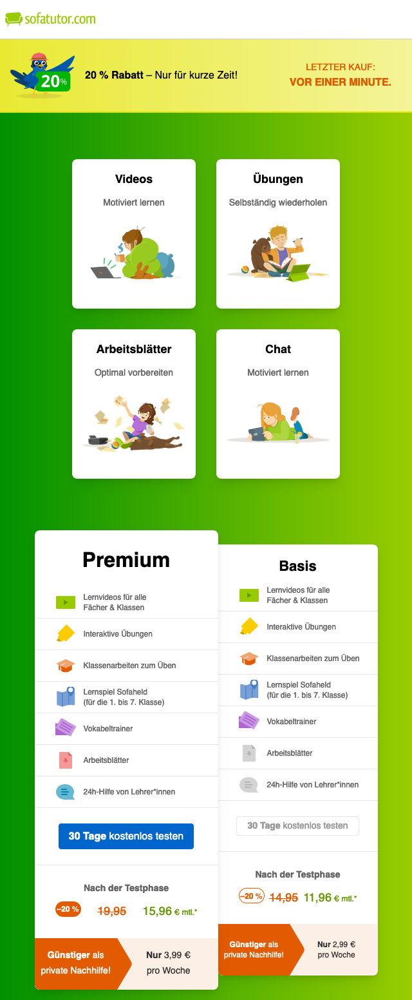

# sofatutor Coding Challenge - Pricing page

## Running the project

- Prerequisite: Install [npm and Node.js](https://docs.npmjs.com/downloading-and-installing-node-js-and-npm)
- Clone the repository

```bash
cd sofatutor-frontend-challenge
npm install
npm run dev
```

## Tech stack

- React JS
- [js-cookie](https://github.com/js-cookie/js-cookie) library
- CSS
- Tailwind CSS

## A little about myself

Hey there, I'm Alina. I like to think of myself as a creative developer, and I've been dreaming of joining the sofatutor team for over a year now (seriously, ask Francisco _wink wink_). And yes, you guessed it—I'm also a big fan of Friends and gifs!

## How did I approach this task?

1. Reviewing the design specifications

Initially, I reviewed the design specification provided, which included a screenshot. Using [excalidraw](https://excalidraw.com/), I dissected the screenshot into smaller components and supplemented it with mobile and tablet view screenshots for future reference.


2. Selecting the Frontend Framework

Regrettably, not having any connection who works with RoR and does not work at sofatutor (an inside joke, I know!), I've opted to develop the project with ReactJS instead. Given your mention of Tailwind, I've also chosen to incorporate it as well.

### From now on you can follow my development process by reviewing my commits as well :)

3. Setting up the development environment

The React project was created using [Vite](https://vitejs.dev/). Additionally, I have configured Tailwind CSS.

4. Creating the project structure

I organized the project by structuring it around the key components I implemented, namely: Header, Banner, and Hero. Subsequently, these components were imported into the Pricing Page. Additionally, I created an SVG folder within the src directory to house all components responsible for rendering SVGs.

5. Implementing the layout

At this point, I wanted to make sure I could easily access all the relevant CSS variables and styles from the project's design system. So, I simply added the color variables to the tailwind.config.js file and typography settings to the index.css file.

Next, I began developing each component using Tailwind CSS classes for styling. I ensured that each component was developed on its own branch, which was later merged into the main branch.

6. Implementing the cookie logic

The cookie logic has been integrated using the [js-cookie](https://github.com/js-cookie/js-cookie) library. To test it easily in the browser, simply adjust the 'bannerVersion' value to 1 and refresh the browser.


7. Final words

Naturally, the project was crafted with a lot of google search. While I'm quite happy with how it turned out, I know there are plenty of details I could make even better. :)

## Screenshots

- Extra small (< 640px)


- Small (min. 640px)



- Medium (min. 768px)


-Large (min. 1024px)


